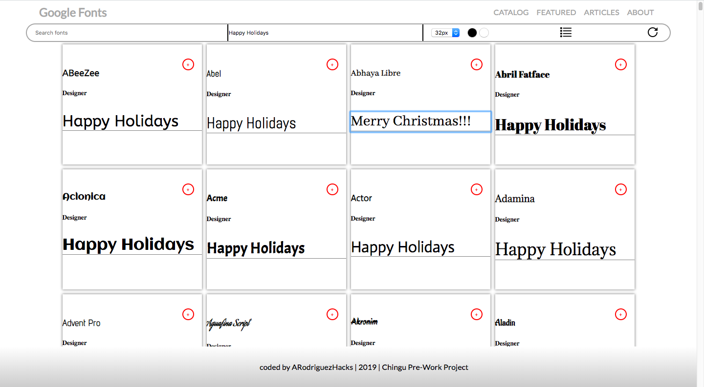
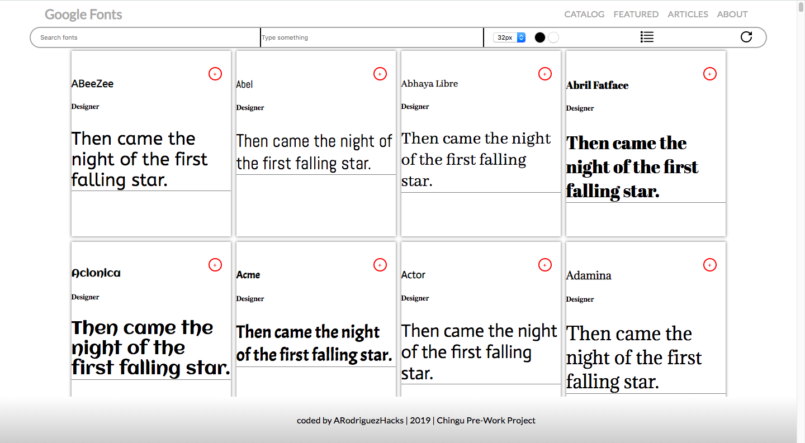

# Favorite Fonts Project

Favorute Fonts re-creates the Google Fonts landing page. No frameworks involved, this project attempts to faithfully bring to life a working fonts website relying heavily on the Google Fonts API.

## Current Features:
* Change text for each font card simultaneously by using the "Type Something" input field.
* Ability to override sample text in each font card with custom text which is immediately displayed
* Custom text returns to the default sample text if the font card is left blank
* Ability to adjust text size by switching among four sizes font sizes
* Working 'reset' button which resets page to default settings

## Technologies:
* HTML
* CSS (Flexbox)
* JavaScript  & the DOM
* Google Fonts API

## How To Install

To install Favorite Fonts and a development environment running all you have to do is clone this repo:

`$ git clone https://github.com/ARodriguezHacks/google-fonts-tier1.git`

or

`$ git clone https://github.com/ARodriguezHacks/google-fonts-tier1.git your-preferred-name-for-project`

## How to Contribute

If you would like to contribute to this project please send an email to angrodri902@gmail.com